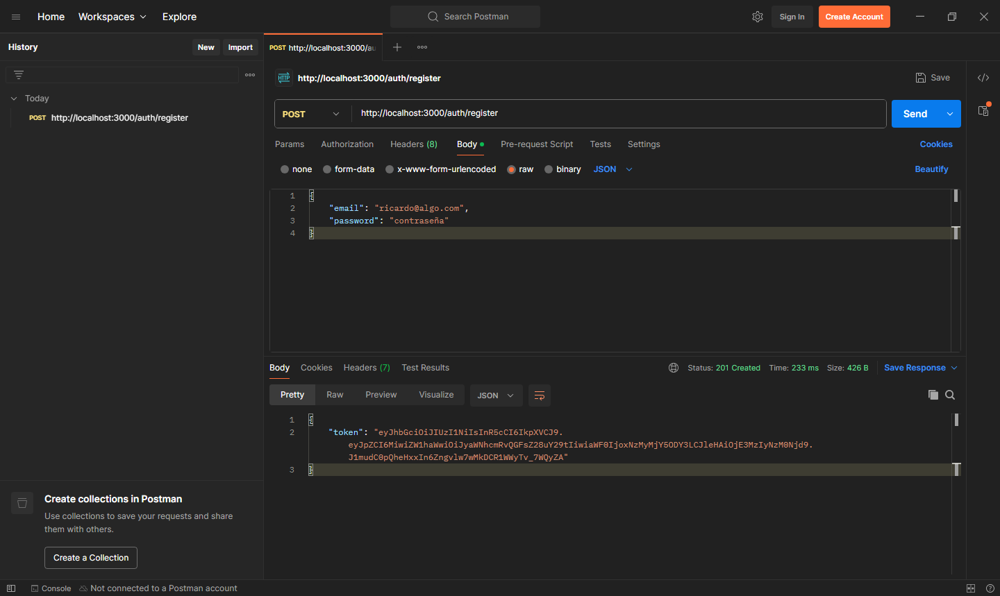
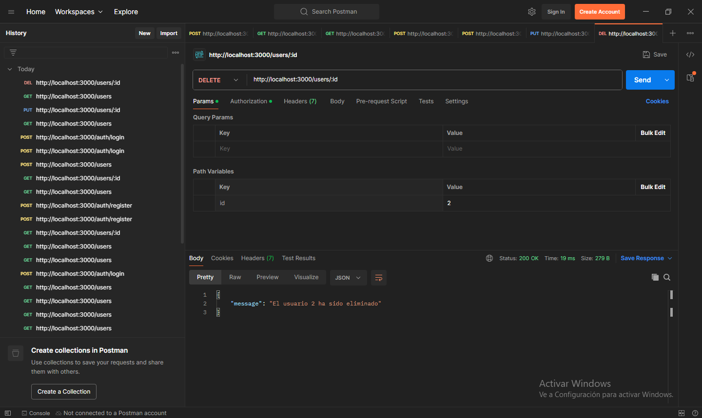

# Proyecto: API REST (CRUD) hecha con Node JS, Express, PostgreSQL, Prisma, JWT, Docker, y TS

[LINK AL BACKEND(RAILWAY)](https://proyecto-api-rest-jwt-sql-ts-production.up.railway.app/)

## Software a instalar

- [Postman](https://www.postman.com/downloads/).
- [TablePlus](https://tableplus.com/download).
- [Docker](https://www.docker.com/get-started/).

## Paquetes de Node JS para desarrollo

1. Ejecutar `npm i ts-node-dev @types/express @types/jsonwebtoken @types/bcrypt @types/node rimraf prisma --save-dev`.

📝Estos paquetes son para trabajar en TS.

## Paquetes de Node JS para producción

1. Ejecutar `npm i express jsonwebtoken bcrypt @prisma/client dotenv typescript`.

## TS dentro de Node JS

1. Ejecutar `npx tsc --init --outDir dist/ --rootDir src`.
2. Agregar a `tsconfig.json` la propiedad `exclude` con el valor `["node_modules","dist"]`.
3. Agregar a `tsconfig.json` la propiedad `include` con el valor `["src"]`.

## Prisma

1. Ejecutar `npx prisma init`.
2. Modificar el archivo `.env` con nuestros datos en `DATABASE_URL`.
3. Ejecutar `npx prisma generate` para generar un modelo.
4. Copiar el modelo y pegarlo en `prisma > schema.prisma`.
5. Adaptar el modelo a nuestra aplicación.
6. Ejecutar `docker compose up -d`.
7. Ejecutar `npx prisma migrate dev`.
8. Ingresar como nombre de la migración `user_mydb`.

📝Los pasos anteriores crean la base de datos `mydb` y la tabla `user`, y el archivo `migration.sql`.

## Ejecutar el proyecto localmente

1. Clonar el repositorio.
2. Abrir el Visual Studio Code.
3. Ejecutar `npm install`.
4. Crear el archivo `.env` utilizando la plantilla.
5. Ejecutar `docker compose up -d`.
6. Ejecutar `npx prisma migrate dev`.
7. Ingresar como nombre de la migración `user_mydb`.
8. Ejecutar `npm run dev`.

## Prueba con TablePlus

## Prueba con Postman

Autor: Ing. Andres Chaparro
